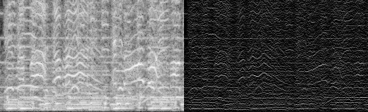

# tfr - time-frequency reassignment in Python

[](https://pypi.python.org/pypi/tfr)


Spectral audio feature extraction using [time-frequency reassignment](https://en.wikipedia.org/wiki/Reassignment_method).



Besides normals spectrograms it allows to compute reassigned spectrograms, transform them (eg. to log-frequency scale) and requantize them (eg. to musical pitch bins). This is useful to obtain good features for audio analysis or machine learning on audio data.

A reassigned spectrogram often provides more precise localization of energy in the time-frequency plane than a plain spectrogram. Roughly said in the reassignment method we use the phase (which is normally discarded) and move the samples on the time-frequency plane to a more suitable place computed from derivatives of the phase.

This library supports reassignment in both frequency and time (both are optional). As well it does requantization from the input overlapping grid to an non-overlapping output grid.

## Installation

```
pip install tfr
```

Or for development (all code changes will be available):

```
git clone https://github.com/bzamecnik/tfr.git
pip install -e tfr
```

## Usage

### Extract a chromagram from an audio file

```
from tfr.analysis import SignalFrames
from tfr.reassignment import chromagram
from tfr.spectrogram import create_window
import soundfile as sf

frame_size = 4096
output_frame_size = 1024
window = create_window(frame_size)
x_frames, x_times = SignalFrames('audio.flac', frame_size=frame_size, hop_size=2048)

# input:
#   - frames of mono audio signal normalized to [0.0, 1.0]
#   - shape: (frame_count, frame_size)
#   - bin_range is in pitch bins where 0 = 440 Hz (A4)
# output:
#   - chromagram of shape (frame_count, bin_count)
#   - values are log-magnitudes in dBFS [-120.0, bin_count]
x_chromagram = chromagram(x_frames, window, x_times, frame_size,
  output_frame_size, fs=fs, to_log=True, bin_range=[-48, 67], bin_division=1)
```

### Extract features via CLI

```
# basic STFT spectrogram
python -m tfr.spectrogram_features audio.flac spectrogram.npz
# reassigned STFT spectrogram
python -m tfr.spectrogram_features audio.flac -t reassigned reassigned_spectrogram.npz
# reassigned chromagram
python -m tfr.spectrogram_features audio.flac -t chromagram chromagram.npz
```

Look for other options:

```
python -m tfr.spectrogram_features --help
```

### scikit-learn transformer

In order to extract chromagram features within a sklearn pipeline, we can use `ChromagramTransformer`:

```
import soundfile as sf
x, fs = sf.read('audio.flac')

from tfr.analysis import to_mono
from tfr.sklearn import ChromagramTransformer
ct = ChromagramTransformer(sample_rate=fs)
x_chromagram = ct.transform(x)

# output:
#  - shape: (frame_count, bin_count)
#   - values in dBFB normalized to [0.0, 1.0]
```

## Status

Currently it's alpha. I'm happy to extract it from some other project into a separate repo and package it. However, the API must be completely redone to be more practical and obvious.

## About

- Author: Bohumír Zámečník ([@bzamecnik](http://twitter.com/bzamecnik))
- License: MIT

## Literature

- [A Unified Theory of Time-Frequency Reassignment](https://arxiv.org/abs/0903.3080) - Kelly R. Fitz, Sean A. Fulop, Digital Signal Processing 30 September 2005
- [Algorithms for computing the time-corrected instantaneous frequency (reassigned) spectrogram, with applications](http://acousticslab.org/learnmoresra/files/fulopfitz2006jasa119.pdf) - Sean A. Fulop, Kelly Fitz, Journal of Acoustical Society of America, Jan 2006
- [Time Frequency Reassignment: A Review and Analysis](http://citeseerx.ist.psu.edu/viewdoc/download?doi=10.1.1.4.1053&rep=rep1&type=pdf) - Stephen W. Hainsworth, Malcolm D. Macleod,
Technical Report, Cambridge University Engineering Dept.
- [Improving the Readability of Time-Frequency and Time-Scale Representations by the Reassignment Method](http://perso.ens-lyon.fr/patrick.flandrin/IEEE_SP1995.pdf) - Francois Auger, Patrick Flandrin, IEEE Transactions on Signal Processing, vol. 43, no. 5, May 1995
- [Time–frequency reassignment: from principles to algorithms](http://citeseerx.ist.psu.edu/viewdoc/download?doi=10.1.1.331.5416&rep=rep1&type=pdf) - P. Flandrin, F. Auger, E. Chassande-Mottin, CRC Press 2003
- [Time-frequency toolbox for Matlab, user’s guide and reference guide](http://iut-saint- nazaire.univ-nantes.fr/~auger/tftb.html) - F.Auger, P.Flandrin, P.Goncalves, O.Lemoine
