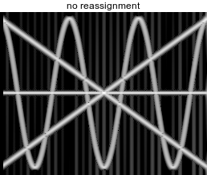

# tfr - time-frequency reassignment in Python

[](https://pypi.python.org/pypi/tfr)


Spectral audio feature extraction using [time-frequency reassignment](https://en.wikipedia.org/wiki/Reassignment_method).



Besides normal spectrograms it allows to compute reassigned spectrograms, transform them (eg. to log-frequency scale) and requantize them (eg. to musical pitch bins). This is useful to obtain good features for audio analysis or machine learning on audio data.

A reassigned spectrogram often provides more precise localization of energy in the time-frequency plane than a plain spectrogram. Roughly said in the reassignment method we use the phase (which is normally discarded) and move the samples on the time-frequency plane to a more suitable place computed from derivatives of the phase.

This library supports reassignment in both frequency and time (both are optional). As well it does requantization from the input overlapping grid to an non-overlapping output grid.

It is a good building block to compute [chromagram features](https://en.wikipedia.org/wiki/Chroma_feature) (aka pitch class profiles) where pitch is transformed into pitch class by ignoring the octave. See also [harmonic pitch class profiles](https://en.wikipedia.org/wiki/Harmonic_pitch_class_profiles).

## Installation

```
pip install tfr
```

Or for development (all code changes will be available):

```
git clone https://github.com/bzamecnik/tfr.git
pip install -e tfr
```

## Usage

### Split audio signal to frames

You can read time-domain signal from an audio file (using the `soundfile` library) and split it into frames for spectral processing.

```
import tfr
signal_frames = tfr.SignalFrames('audio.flac')
```

`SignalFrames` instance contains the signal split into frames and some metadata useful for further processing.

The signal values are normalized to [0.0, 1.0] and the channels are converted to mono.

It is possible to provide the signal a numpy array as well.

```
import tfr
x = np.sin(2 * np.pi * 10 * np.linspace(0, 1, 1000))
signal_frames = tfr.SignalFrames(x)
```

### Minimal example - pitchgram from audio file

```
import tfr
x_pitchgram = tfr.pitchgram(tfr.SignalFrames('audio.flac'))
```

From audio frames it computes a reassigned pitchgram of shape `(frame_count, bin_count)` with values being log-magnitudes in dBFS `[-120.0, 0.0]`. Sensible parameters are used by default, but you can change them if you wish.

### Reassigned spectrogram

Like normal one but sharper and requantized.

```
import tfr
x_spectrogram = tfr.reassigned_spectrogram(tfr.SignalFrames('audio.flac'))
```

### Signal frames with specific parameters

- `frame_size` - affects the FFT size - trade-off between frequency and time resolution, good to use powers of two, eg. 4096
- `hop_size` - affects the overlap between frames since a window edges fall to zero, eg. half of frame_size (2048)

```
import tfr
signal_frames = tfr.SignalFrames('audio.flac', frame_size=1024, hop_size=256)
```

### General spectrogram API

The `pitchgram` and `reassigned_spectrogram` functions are just syntax sugar for the `Spectrogram` class. You can use it directly to gain more control.

General usage:

```
x_spectrogram = tfr.Spectrogram(signal_frames).reassigned()
```

From one Spectrogram instance you can efficiently compute reassigned spectrograms with various parameters.

```
s = tfr.Spectrogram(signal_frames)
x_spectrogram_tf = s.reassigned(output_frame_size=4096)
x_spectrogram_f = s.reassigned(output_frame_size=512)
```

Different window function (by default we use Hann window):

```
import scipy
x_spectrogram = tfr.Spectrogram(signal_frames, window=scipy.blackman).reassigned()
```

Different output frame size (by default we make it the same as input hop size):

```
x_spectrogram = tfr.Spectrogram(signal_frames).reassigned(output_frame_size=512)
```

Disable reassignment of time and frequency separately:

```
s = tfr.Spectrogram(signal_frames)
x_spectrogram = s.reassigned(reassign_time=False, reassign_frequency=False)
x_spectrogram_t = s.reassigned(reassign_frequency=False)
x_spectrogram_f = s.reassigned(reassign_time=False)
x_spectrogram_tf = s.reassigned()
```

Disable decibel transform of output values:

```
x_spectrogram = tfr.Spectrogram(signal_frames).reassigned(magnitudes='power')
```

Magnitudes in the spectrogram can be transformed at the end in multiple ways given by the `magnitudes` parameter:

- `linear` - energy spectrum
- `power` - power spectrum
- `power_db` - power spectrum in decibels, range: [-120, 0]
- `power_db_normalized` - power spectrum in decibels normalized to range: [0, 1]
  - this is useful as a feature

Use some specific transformation of the output values. `LinearTransform` (default) is just for normal spectrogram, `PitchTransform` is for pitchgram. Or you can write your own.

```
x_spectrogram = tfr.Spectrogram(signal_frames).reassigned(transform=LinearTransform())
```

```
x_pitchgram = tfr.Spectrogram(signal_frames).reassigned(transform=PitchTransform())
```

```
class LogTransform():
  def __init__(self, bin_count=100)
    self.bin_count = bin_count

  def transform_freqs(self, X_inst_freqs, sample_rate):
      X_y = np.log10(np.maximum(sample_rate * X_inst_freqs, eps))
      bin_range = (0, np.log10(sample_rate))
      return X_y, self.bin_count, bin_range

x_log_spectrogram = tfr.Spectrogram(signal_frames).reassigned(transform=LogTransform())
```

### Pitchgram parameters

In pitchgram the frequencies are transformed into pitches in some tuning and then quantized to bins. You can specify the tuning range of pitch bins and their subdivision.

- `tuning` - instance of `Tuning` class, transforms between pitch and frequency
- `bin_range` is in pitches where 0 = 440 Hz (A4), 12 is A5, -12 is A3, etc.
- `bin_division` - bins per each pitch

### Extract features via CLI

```
# basic STFT spectrogram
python -m tfr.spectrogram_features audio.flac spectrogram.npz
# reassigned STFT spectrogram
python -m tfr.spectrogram_features audio.flac -t reassigned reassigned_spectrogram.npz
# reassigned pitchgram
python -m tfr.spectrogram_features audio.flac -t pitchgram pitchgram.npz
```

Look for other options:

```
python -m tfr.spectrogram_features --help
```

### scikit-learn transformer

In order to extract pitchgram features within a sklearn pipeline, we can use `PitchgramTransformer`:

```
import soundfile as sf
x, fs = sf.read('audio.flac')

from tfr.signal import to_mono
from tfr.sklearn import PitchgramTransformer
ct = PitchgramTransformer(sample_rate=fs)
x_pitchgram = ct.transform(x)

# output:
#  - shape: (frame_count, bin_count)
#   - values in dBFB normalized to [0.0, 1.0]
```

## Status

Currently it's alpha. I'm happy to extract it from some other project into a separate repo and package it. However, the API must be completely redone to be more practical and obvious.

## About

- Author: Bohumír Zámečník ([@bzamecnik](http://twitter.com/bzamecnik))
- License: MIT

### Support the project

Need some consulting or coding work regarding audio processing, machine learning or big data? Drop me a message via [email](mailto:bohumir.zamecnik@gmail.com?subject=Work+inquiry+-+based+on+tfr) or [LinkedIn](https://www.linkedin.com/in/bohumirzamecnik). Or just say hello :).

## Literature

- [A Unified Theory of Time-Frequency Reassignment](https://arxiv.org/abs/0903.3080) - Kelly R. Fitz, Sean A. Fulop, Digital Signal Processing 30 September 2005
- [Algorithms for computing the time-corrected instantaneous frequency (reassigned) spectrogram, with applications](http://acousticslab.org/learnmoresra/files/fulopfitz2006jasa119.pdf) - Sean A. Fulop, Kelly Fitz, Journal of Acoustical Society of America, Jan 2006
- [Time Frequency Reassignment: A Review and Analysis](http://citeseerx.ist.psu.edu/viewdoc/download?doi=10.1.1.4.1053&rep=rep1&type=pdf) - Stephen W. Hainsworth, Malcolm D. Macleod,
Technical Report, Cambridge University Engineering Dept.
- [Improving the Readability of Time-Frequency and Time-Scale Representations by the Reassignment Method](http://perso.ens-lyon.fr/patrick.flandrin/IEEE_SP1995.pdf) - Francois Auger, Patrick Flandrin, IEEE Transactions on Signal Processing, vol. 43, no. 5, May 1995
- [Time–frequency reassignment: from principles to algorithms](http://citeseerx.ist.psu.edu/viewdoc/download?doi=10.1.1.331.5416&rep=rep1&type=pdf) - P. Flandrin, F. Auger, E. Chassande-Mottin, CRC Press 2003
- [Time-frequency toolbox for Matlab, user’s guide and reference guide](http://iut-saint-nazaire.univ-nantes.fr/~auger/tftb.html) - F.Auger, P.Flandrin, P.Goncalves, O.Lemoine
